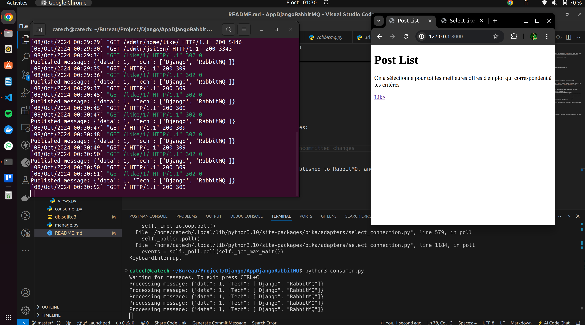

# Django RabbitMQ Example

This project demonstrates how to integrate RabbitMQ with Django using the `pika` library for message queuing. It includes message producers and consumers, allowing for asynchronous task handling and communication between services.

## Features
- Publish messages to RabbitMQ queues.
- Consume messages and process them in Django (e.g., notifications, likes).
- Integration with Django models for data handling.

## Requirements
- Python 3.x
- Django 4.x
- RabbitMQ
- `pika` library for RabbitMQ communication

## Installation

1. Clone the repository:

    ```bash
    git clone https://github.com/madanimohadhabib/django-rabbitmq-example.git
    cd django-rabbitmq-example
    ```


2. Install dependencies:

    ```bash
    pip install -r requirements.txt
    ```

3. Set up Django:

    ```bash
    python manage.py migrate
    ```

4. Install and configure RabbitMQ on your machine or use a cloud RabbitMQ provider like CloudAMQP.

## RabbitMQ Setup

In your RabbitMQ instance, create a queue named `my_queue` (or change the queue name in the code). You can also modify the `amqps://...` URL with your credentials and RabbitMQ host in the `producer.py` and `consumer.py` files.

## Files Overview

### `producer.py`
- This script handles the publishing of messages to the RabbitMQ queue. It includes the `publish_message` function, which sends messages to the queue.
- It uses the `pika.URLParameters` to connect to RabbitMQ, declares a queue, and publishes a JSON message.

### `consumer.py`
- This file is responsible for consuming messages from the RabbitMQ queue.
- It listens to the `my_queue` queue and processes each message using a callback function.
- The consumer processes the incoming message (such as likes or notifications) and updates the Django database models accordingly.

### `rabbitmq.py`
- This is an additional utility script to encapsulate reusable RabbitMQ logic, such as starting consumers, connecting to the RabbitMQ server, and queue declarations.

### `home/models.py`
- Defines the models such as `Post`, `Like`, and `Notification` which are used in the project.
- These models are updated based on messages received from the RabbitMQ consumer.

### `views.py`
- Contains Django views to interact with the `Post` model.
- Includes the `like_post` view that creates a like entry in the database and publishes a like notification to RabbitMQ.

## Running the Project

1. Run the Django development server:

    ```bash
    python manage.py runserver
    ```

2. Run the RabbitMQ consumer to listen for messages:

    ```bash
    python consumer.py
    ```

3. When a user likes a post, a message will be published to RabbitMQ, and the consumer will process the like and send a notification to the post author.

## Example of Terminal Execution
Below is an example of what the terminal will look like when you run the RabbitMQ consumer and publish a message:
